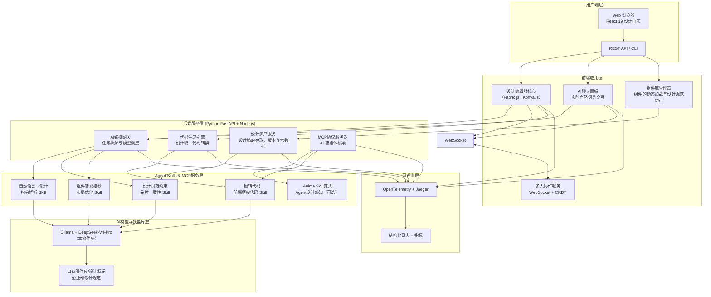

## 第一部分：选题填表

| **类别** | **编号** | **题目** | **限报** | **要求** | **需求概述** | **担任角色** | **建议方案** | **建议语言** | **成果形式** |
|:---:|:---:|:---|:---:|:---:|:---|:---|:---|:---:|:---|
| **UI、前端** | 28 | **面向2026的AI原生产品设计工具** | 4 | | 构建一款AI原生的产品设计与研发协同平台，实现“自然语言驱动产品设计”的全流程体验。平台以设计师体验为核心，基于2026年设计工具前沿趋势（Vibe Design、Agent-Directed Design、Design as Code），实现自然语言生成高保真UI初稿、Agent辅助的智能布局与推荐、设计意图的统一规范约束管理、多模态设计资源融合、开放MCP服务生态无缝接入及一键转代码能力。产品将从“辅助绘图”升级为“设计Agent的大脑和画板”，让产品经理与设计师体验对话式设计的完整工作流。核心指标：从指令到生成首个可用设计稿的平均时间<30秒，设计稿对预设设计规范的兼容性>85%，一键转代码的前端还原度>70%。 | 架构师，前端，全栈 | **后端**：Python FastAPI（AI任务调度与编排）+ Node.js 22+（设计资产管理与协作）；**前端**：React 19/Vue 3 + TypeScript + TailwindCSS；**画布渲染**：Fabric.js / Konva.js（轻量级矢量引擎）；**AI模型**：Ollama + DeepSeek-V4-Pro（本地化保障数据安全）或GPT-5.4-online；**设计规范与组件库**：MDUI等企业设计系统SDK；**开放协议**：MCP协议 + Agent Skills能力体系（Anima Skill范式），支持第三方Agent接入；**协作服务**：WebSocket（多人实时在线）；**存储**：MinIO（设计文件托管）+ PostgreSQL（元数据）+ Redis（协作状态缓存）；**可观测性**：OpenTelemetry + Jaeger；**部署**：Docker Compose | TypeScript/React + Python + Node.js | 系统、性能报告 |


## 第二部分：完整设计方案与开发思路（2周版）

### 一、选题背景与价值定位

2026年，产品设计工具正经历着一场深刻的重构。市场研究数据显示，2026年全球AI设计工具市场规模预计将达到42亿美元，年增长率超过85%。Figma《State of the Designer 2026》报告显示，72%的设计师已将生成式AI纳入日常设计流程，其中98%在过去一年中增加了AI工具的使用频率。更值得注意的是，已有78%的设计师在常规工作中运用AI工具来辅助设计输出，这是2024年数据的两倍有余。这一数据变化背后揭示出：AI不再是花哨的附加功能，而是必须融为生态基底的底层新结构。在可用性与功能的拉锯战中，设计师通过AI工具获得显著的生产力提升，91%的设计师表示AI改善了设计质量，89%工作效率更高，80%团队协作更顺畅。

与此同时，设计工具的技术架构正在发生根本性重构。由2025年5月“氛围编码”（Vibe Coding）概念启发的“氛围设计”（Vibe Design）正迅速成为行业主流。Google Stitch提出了全新的原生AI无限画布与氛围设计理念，用自然语言直接构建完整的视觉系统。阿里QoderWork上线了“Design as Code”全链接设计工作台，实现设计稿与可运行代码同源生成，其内置的一百多种风格参考与数十个设计技能在自然语言交互后可直接落入前端工程流水线。腾讯Ardot则通过MCP协议实现从需求描述到可编辑设计稿到最终编程代码的链条闭环。此外，Vercel v0专注生产级组件生成，Lovable实现了从原型到全栈应用的完整闭环，Anima Skill使AI智能体理解品牌与设计语言，生成设计感知的高保真界面。而OpenPencil以MIT许可正式开源，原生AI运行于设计画布内，实现了“免Figma锁仓，自带AI”的效果。

本项目的核心价值在于：让学生在2周内构建一个汲取2026年前沿设计工具精髓的AI原生产品设计平台原型，让产品经理、设计师与研发之间真正实现“自然语言→可编辑设计稿→一致化代码”的统一交付，精准对标当下AI Native设计工具的演进方向，产出兼具实际用途和前瞻思考的设计工程项目。


### 二、系统架构设计



### 三、核心功能模块设计（2周可完成）

#### 模块1：AI驱动的自然语言生成UI（核心高光模块）

这是产品最核心的差异化创新点。本模块借鉴Google Stitch的无限画布与氛围设计理念，以及腾讯Ardot“自然语言→实时可编辑设计初稿”的生成体系，从模糊的意图描述直接触发多轮可信、高完成度的UI设计生成。

设计核心：输入自然语言约束（如“设计一个极简风格的金融数据仪表板，灰白配色，深色模式可选”），AI编排网关调用解析Skill快速输出设计意图向量，从组件库中提取与业务、审美偏好高度匹配的原子组件，并按照构图逻辑动态排布出一版可即时编辑的设计文件。底层生成的全量组件、色值及字体样式均可视为设计画布上的标准图层，由用户再度编辑调优。该设计确保AI既产出大方向，又不制造“黑盒——最终交付的界面可直接被精细微调，适配最终版一致性要求。

```typescript
// 前端调用AI生成设计稿的示例
const generateDesign = async (prompt: string) => {
  const response = await fetch('/api/ai/generate', {
    method: 'POST',
    body: JSON.stringify({
      prompt: prompt,
      designSystem: 'brand-design-token-23v1',
      constraints: { minWidth: 1200, theme: 'financial' }
    })
  })
  const designFile = await response.json()
  // designFile 包含可渲染的Canvas节点树与样式数据
  canvas.loadFromJSON(designFile)
}
```

#### 模块2：MCP协议与智能体生态引入

紧跟2026年设计工具开放化趋势，本平台通过MCP协议向第三方AI Agent（如Claude Code、ChatGPT、Cursor）开放设计上下文，让外界智能体能够读取、修改和追加设计资产，甚至遵循团队规范生成符合设计要求的设计方案。用户打开平台的MCP服务后，可允许Cursor内编辑器拿到当前设计稿上下文的变量结构，以匹配代码生成。

在效率实现上，本模块参照 Anima Skill 模式，使外部的Agent（比如Claude Code、Cursor）可像技能一样操控平台中的设计画布及规则，实现“AI Agent驱动设计”的闭环。核心实现方式是Agent-Skills框架与MCP协议桥接，将平台内暴露的“生成组件”“修改变量”“一键提取设计规范”以Skills的方式提供给外部AI Agent调用。

#### 模块3：智能设计规范与品牌约束系统

随着设计生成能力提升，设计一致性成为首要挑战。2026年的行业趋势显示：组件化协同与设计系统自动维护，变成了AI驱动大规模设计的必要条件。本项目将为企业级的组件库与设计令牌（Design Tokens）建设提供一个可靠容器，用来持久存储规范的色值、字体、间距，并在线供AI编排网关查询。当系统生成新界面时，强制从中心设计规范取值。

进一步地，系统参考Figma AI Design System的设计系统护城河思路，并内置类似Claude Design与v0对shadcn/ui标准的默认遵循能力，让用户在设计生成过程中获得“所见即合规”的品牌和代码产出能力。

```yaml
# 设计规范定义（design-system.yaml）
colors:
  primary: '#0052D9'
  secondary: '#7C4DFF'
  background: '#F5F5F5'
typography:
  heading: { font: 'Inter', weight: 600, size: '24px' }
  body: { font: 'Inter', weight: 400, size: '14px' }
```

#### 模块4：Design as Code与一键转代码

本项目坚定不移实现“Design as Code”路径——设计稿不再只是一张静态图，而是结构化可布局可计算文件，为研发前置可直接生成React/Vue组件工程代码。此策略既跟随QoderWork和腾讯Ardot的迁移交付能力，也为AI未来时代的全栈式设计交付奠定基础。

实现方法：设计画布通过JSON描述，映射布局样式与原子组件类名。代码生成引擎通过AST方式将每设计图层转化为现代化前端的代码产物，支持响应式断点和状态管理数据绑定。

```python
# 代码生成引擎核心逻辑（Python + AST）
class CodeGenerator:
    def generate(self, design_json: dict, framework: str):
        if framework == "react":
            return self._generate_react_component(design_json)
        elif framework == "vue":
            return self._generate_vue_component(design_json)
```

#### 模块5：多人实时协作（可选进阶）

融合WebSocket与CRDT(Conflict-free Replicated Data Type)协作同步技术，实现AI与人工都可以在同一画布上协同编辑，跟踪每一步变更，带来AI协同的设计体验。借鉴Figma协作生态成熟理念，提供多位PM、设计师同步修订和设计决策功能。

#### 模块6：可观测性与全链路追踪

参照行业前沿实践，使用OpenTelemetry上报AI生成耗时和工具调用情况，并由Jaeger可视化展示完整的设计生成、代码生成以及后续Skill执行的精细化链路，方便进一步分析模型瓶颈和协作性能。在平台演进过程中支持持续追踪AI设计辅助的效果提升。

### 四、开发路线图（2周/10个工作日）

| 阶段 | 天数 | 任务 | 输出物 |
|:---|:---|:---|:---|
| **第1-2天** | 2 | 设计环境搭建：React/Fabric.js画布实现；基础画布矢量工具（拖放/缩放/框选）；MCP基础服务配置 | 可拖拽的基础设计画板 |
| **第3-4天** | 2 | 后端FastAPI+Node.js服务器整合；AI编排网关集成Ollama等大语言模型；完成自然语言到结构描述的设计转换链路 | 文本指令可产出简单界面布局 |
| **第5-6天** | 2 | 集成设计组件库自动匹配+设计规范约束（通过Token维护一致样式）；UI组件实时调优调试接口；智能布局推荐引擎 | 界面生成符合品牌规范约束 |
| **第7-8天** | 2 | 代码生成引擎完成（React / Vue 产物输出）；MCP协议服务器部署与接入；Skills服务装饰调用 | 设计稿可生成可运行前端组件 |
| **第9-10天** | 2 | 多人实时协作服务；OpenTelemetry+Jaeger全链路可观测；Web控制台优化；端到端场景体验；撰写项目报告 | 完整交付+性能验证 |

### 五、技术挑战与解决策略

| 挑战 | 解决策略 |
|:---|:---|
| 自然语言到精准意图映射的歧义问题 | 采用多轮“意图解析→交互追问”模式，AI在生成设计布局前主动询问确定性参数，采用设计计划确认机制，可极大减少无效迭代；目前QoderWork已验证此模式的使用效果良好。 |
| 设计规范一致性贯彻难 | 建立强制设计令牌统一库+约束AI生成前获得样式参考数据，通过实时提示与重构解析确保视觉品牌一致性。 |
| 代码生成与响应式布局的复杂度 | 从AST构建生成方案开始，结合Media Query自动监测规则；对于部分复杂交互动效场景可逐步迭代完善。 |
| AI本地模型性能和推理时间 | 采用本地Ollama（DeepSeek-V4-Pro）+云端大模型混用模式；对轻量布局推理优先用本地模型，设计建议、品牌风格等用云模型，成本与性能平衡。 |

### 六、验证与演示方案

**功能验证场景**：用户输入“帮我设计一款电商活动优惠券领取页面，突出优惠力度，圆角风格，品牌主色是#FF6B6B，红色调”，平台展示完整流程：

1. **AI生成初稿**：2个以上高保真方案10-20秒内生成并展示，快速探索不同视觉风格。
2. **品牌一致性检查**：自动弹出样式标签检测报告，点击颜色用色超过品牌主色阈值的发现，AI根据此规约自动替换。
3. **编辑与微调**：通过聊天框输入“把优惠券卡片间距增大，圆角再大一点”，实时刷新设计画布。
4. **一键转代码**：导出React+TypeScript标准化代码，可直接运行并查看浏览器预览效果。

**性能基准目标**：
- 自然语言至首个设计稿平均耗时 ≤ 30秒
- AI生成设计稿对品牌设计规范的兼容性 ≥ 85%
- 一键转代码的前端还原度 ≥ 70%（功能性页面）
- 设计协作同步延迟 ≤ 200ms

### 七、拓展方向

- **面向AIGC的设计推荐引擎**：基于用户画像和历史偏好推荐生成的设计风格与布局方案，形成更加个性化的Agent建议。
- **更多前端框架适配**：支持Angular、SwiftUI等更多技术栈的代码生成。
- **AIGC设计资产管理**：自动识别团队高频设计模板，加入技能库，逐步构建设计智能化资产系统。
- **MCP接入智能体生态**：与Claude Code、Cursor等AI编程助手打通，在自然语言设计描述后直接触发代码生成与开发调试流程，完整打通“设计-研发”闭环。

### 八、成果形式

- 源代码仓库（GitHub），包含前端设计画布、AI编排网关、MCP服务与Skill模块、代码生成引擎等核心代码
- Docker Compose编排文件，一键启动全部服务（Ollama + FastAPI + Node.js + PostgreSQL + MinIO + Redis + Jaeger）
- Web管理控制台，展示实时自然语言生成UI过程、可编辑设计画布、代码产物展示以及Jaeger追踪链路
- 项目设计报告（需求分析、架构设计、自然语言设计生成模块详述、对比2026主流AI设计产品趋势的优劣分析、实测性能数据及工作流构建总结）